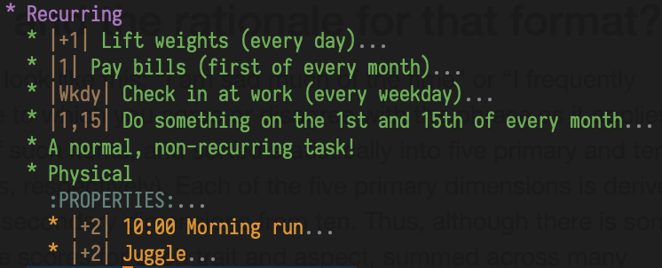

# org-recur

[](https://github.com/m-cat/org-recur)

Recurring org-mode tasks.

## Screenshot



## About

This package extends org-mode and org-agenda with support for defining recurring tasks and easily scheduling them.

I initially wrote this package for myself, because I've found that simple task management systems are the most effective for me. With this package I can just press `d` in the org-agenda to quickly reschedule a recurring chore -- neat! I hope that others happen to find this useful as well.

## Usage

By adding some simple syntax to a task heading you can control how often the task should recur. Examples:

+ `|+2|`: Recur every other day.
+ `|+w|`: Recur every week.
+ `|1|`: Recur on the first of every month.
+ `|Thu|`: Recur every Thursday.
+ *`|Sun,Sat|`: Recur every Sunday and Saturday.
+ *`|Wkdy|`: Recur every weekday.

The syntax is almost identical to the one used by `org-schedule`, with examples of additional syntax, provided by org-recur, marked by `*`.

You can use the provided command `org-recur-finish` to reschedule tasks based on their recurrence syntax. With your cursor over a task, in either org-mode or org-agenda, call `org-recur-finish` and it will handle the task intelligently. If the task does not contain a recurrence syntax, the command will ignore it by default, though this is customizable.

## Installing

Make sure you have set up [MELPA](http://melpa.milkbox.net/#/getting-started) and run:

```
M-x package-install RET org-recur RET
```

Or, if you have [use-package](https://github.com/jwiegley/use-package):

```elisp
(use-package org-recur
  :demand t)
```

## Recommended Configuration

The following `use-package` configuration sets the suggested keybindings (`C-c d`, as well as `d` in `org-agenda-mode`). It also enables `org-recur-finish` to act on headings without recurrence syntax, marking them done and archiving them.

```elisp
(use-package org-recur
  :demand t
  :bind ("C-c d" . org-recur-finish)

  :config

  ;; Rebind the 'd' key in org-agenda (default: `org-agenda-day-view').
  (define-key org-agenda-mode-map (kbd "d") 'org-recur-finish)

  (setq org-recur-finish-done t
        org-recur-finish-archive t)
  )
```

## Recommended org-mode settings

Here are some org-mode settings that work well in conjunction with org-recur.

Refresh the org-agenda whenever a task is rescheduled:

```elisp
;; Refresh org-agenda after rescheduling a task.
(defun org-agenda-refresh ()
  "Refresh all `org-agenda' buffers."
  (dolist (buffer (buffer-list))
    (with-current-buffer buffer
      (when (derived-mode-p 'org-agenda-mode)
        (org-agenda-maybe-redo)
        ))))

(defadvice org-schedule (after refresh-agenda activate)
  "Refresh org-agenda."
  (org-agenda-refresh))
```

Keep the task metadata clean:

```elisp
;; Log time a task was set to Done.
(setq org-log-done (quote time))

;; Don't log the time a task was rescheduled or redeadlined.
(setq org-log-redeadline nil)
(setq org-log-reschedule nil)
```

## Alternatives

### Repeated tasks

org-mode already supports ["repeated tasks"](https://orgmode.org/manual/Repeated-tasks.html), but it has some shortcomings:

+ Tasks need to have a TODO status set. I have a *lot* of recurring tasks and I don't want them all to be TODO.
+ You can't see how often a task recurs from the org-agenda view, you only see the task's headline and not its `SCHEDULED`/`DEADLINE` timestamps.
+ Repeated tasks require the `.+` syntax to shift the date based on today, which is what I almost always want. If I want to schedule a `+2` task to tomorrow I can do that manually, but I still want it to be clear that the task should recur every two days.

org-recur is also simpler. I want to think as little as possible when I organize my time, helping  keep my personal time management frictionless.

### Sexp diary entries

You can also get some features of org-recur using [Diary-style sexp entries](https://orgmode.org/guide/Timestamps.html). For example, you can get the `|1,15|` recurrence with `SCHEDULED: <%%(diary-date t '(1 15) 2019)>` (see `C-h f diary-date`).

The biggest shortcoming of this approach, it seems to me, is the complexity of it. You also can't see the timestamp from the org-agenda view.
